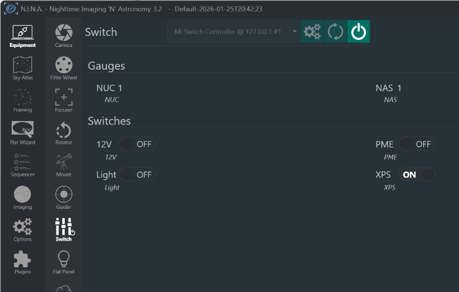

# Mi Alpaca

ASCOM Alpaca server for Xiaomi Mi Smart Switches, allowing control of Xiaomi smart switches through the ASCOM Alpaca protocol.

## Overview

This project implements an ASCOM Alpaca API server that bridges Xiaomi Mi Smart Switches to ASCOM-compatible astronomy software. It enables control of Xiaomi switches as ASCOM Switch devices.




## Features

- ASCOM Alpaca API compatibility
- Discovery server for automatic device detection
- Support for multiple Xiaomi Mi Smart Switches
- Per-device configuration (read-only/read-write modes)
- Custom device naming

## Requirements

- Go 1.22.2 or later
- Xiaomi Mi Smart Switches on your local network
- Device tokens for each switch (see Configuration section)

## Installation

1. Clone this repository:
```bash
git clone https://github.com/exploded/mi-alpaca.git
cd mi-alpaca
```

2. Install dependencies:
```bash
go mod download
```

3. Build the application:
```bash
go build -o mi_alpaca
```

## Configuration

### Creating settings.json

Before running the application, you need to create a `settings.json` file in the project root directory. This file contains the configuration for your Xiaomi switches.

#### settings.json Structure

Create a file named `settings.json` with the following structure:

```json
{
    "connected": false,
    "devices": [
        {
            "ip": "192.168.1.xxx",
            "token": "your_device_token_here",
            "name": "Switch 1",
            "devicetype": "Switch",
            "number": 1,
            "uniqueid": "unique-uuid-here",
            "id": 0,
            "customname": "Custom Device Name",
            "min": 0,
            "max": 1,
            "step": 1,
            "canwrite": true,
            "value": 0
        }
    ]
}
```

#### Field Descriptions

- **ip**: The local IP address of your Xiaomi switch
- **token**: The device token (32-character hex string) - see "Getting Device Tokens" below
- **name**: Default name for the device (e.g., "Switch 1", "Switch 2")
- **devicetype**: Always "Switch" for switch devices
- **number**: Sequential device number (1, 2, 3, etc.)
- **uniqueid**: A unique UUID for the device (generate using an online UUID generator)
- **id**: Zero-based index (0, 1, 2, etc.)
- **customname**: Your custom name for the device (e.g., "Office Light", "Server Power")
- **min**: Minimum value (0 for off)
- **max**: Maximum value (1 for on)
- **step**: Step increment (always 1 for switches)
- **canwrite**: Set to `true` to allow control, `false` for read-only
- **value**: Initial/current state (0 = off, 1 = on)

#### Getting Device Tokens

To obtain the device token for your Xiaomi switches, you can use one of these methods:

1. **Using Xiaomi Home App with Android**:
   - Enable developer mode on your Android device
   - Use a file explorer to navigate to `/sdcard/Android/data/com.xiaomi.smarthome/files/` or similar
   - Look for database or log files containing the token

2. **Using python-miio**:
   ```bash
   pip install python-miio
   miiocli discover
   ```

3. **Using the Mi Home app database** (requires rooted Android or iOS backup extraction)

Refer to the [python-miio documentation](https://python-miio.readthedocs.io/en/latest/discovery.html) for detailed instructions.

#### Example settings.json with Multiple Devices

```json
{
    "connected": false,
    "devices": [
        {
            "ip": "192.168.1.101",
            "token": "3ab8e0b83a1a31a7a548aa5d8a7c7fa1",
            "name": "Switch 1",
            "devicetype": "Switch",
            "number": 1,
            "uniqueid": "6fd5bae2-40ed-489f-b7f3-a562822e41e9",
            "id": 0,
            "customname": "Office Light",
            "min": 0,
            "max": 1,
            "step": 1,
            "canwrite": true,
            "value": 0
        },
        {
            "ip": "192.168.1.102",
            "token": "1d4e03753dadc121629b5f6e958e1141",
            "name": "Switch 2",
            "devicetype": "Switch",
            "number": 2,
            "uniqueid": "86c4a6ea-650d-15cd-cd4d-1771c76edae5",
            "id": 1,
            "customname": "Server Power",
            "min": 0,
            "max": 1,
            "step": 1,
            "canwrite": false,
            "value": 1
        }
    ]
}
```

## Usage

1. Make sure `settings.json` is properly configured
2. Run the application:
```bash
./mi_alpaca
```
Or on Windows:
```cmd
mi_alpaca.exe
```

The server will start on:
- **API Server**: `http://127.0.0.1:8080`
- **Discovery Server**: UDP port `32227`

## ASCOM Alpaca Endpoints

The server implements standard ASCOM Alpaca Switch device endpoints:

- Device discovery: UDP broadcast on port 32227
- Management API: `http://127.0.0.1:8080/management/`
- Switch API: `http://127.0.0.1:8080/api/v1/switch/{device_number}/`

## Troubleshooting

- **Cannot connect to device**: Verify the IP address and token are correct
- **Device not responding**: Ensure the Xiaomi switch is powered on and connected to your network
- **Permission denied**: Check that the switch's `canwrite` field is set to `true` if you want to control it

## License

See the [LICENSE](LICENSE) file for details.

## Contributing

Contributions are welcome! Please feel free to submit a Pull Request.
